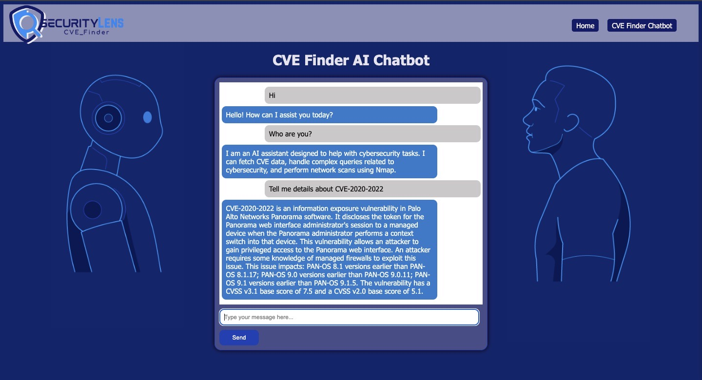
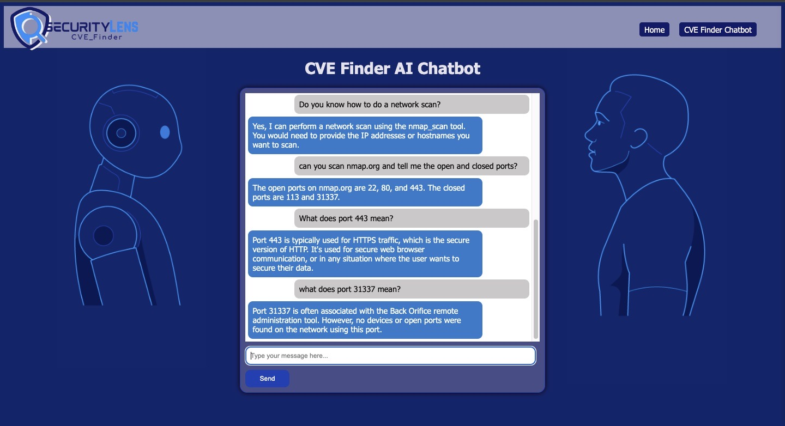

# SecurityLens-CVEFinder

SecurityLens is an AI-powered chatbot integrated into a Django-based web application designed to efficiently retrieve and display information about Common Vulnerabilities and Exposures (CVEs). Developed with the help of OpenAI's API and LangChain, SecurityLens provides users with detailed insights into vulnerabilities associated with various systems and software.

## Features

1. AI Chatbot Integration: Leveraging LangChain with OpenAI's GPT-4 model, SecurityLens responds to user queries about specific CVEs or related keywords.
2. Django Backend: A robust Django backend that manages user requests, interacts with the CVE database, and serves the AI-generated responses.
3. CVEs Data Retrieval: Fetches data from the National Vulnerability Database (NVD) using APIs to provide up-to-date information on CVEs.
4. Flexible Query Handling: Capable of interpreting both specific CVE IDs (e.g., Give me details about CVE-2020-2020) and broader keyword searches (e.g., "Give me CVEs related to Windows").

## Tech Stack

1. Backend: Django, Python
2. Frontend: HTML, CSS, JavaScript
3. AI Integration: LangChain, OpenAI's API
4. Containerization: Docker and Docker Compose for easy deployment and scalability
5. Database: SQLite (default)
6. Cloud: AWS

## Getting Started
Prerequisites
1. Docker and Docker Compose installed on your system
2. OpenAI API key
3. Python 3.x and Django installed locally for development

## Installation
1. Clone the Repository:

<!--Copy code
git clone https://github.com/yourusername/SecurityLens.git
cd SecurityLens -->

2. Set Up Environment Variables: 
Create a .env file in the root directory and add your OpenAI API key:

Copy code 
OPENAI_API_KEY=your_openai_api_key

3. Build and Run with Docker: 
Ensure all dependencies are listed in your requirements.txt, including langchain and langchain_openai.

Copy code
docker-compose up --build

4. Access the Application: 
Open your browser and navigate to http://localhost:8000 to interact with the SecurityLens chatbot.

## Usage
Search for CVEs:

1. Enter a CVE ID (e.g., CVE-2021-34527) or a keyword (e.g., NetBIOS) in the search bar.
The application will fetch the relevant CVE information and display it in an easy-to-understand format.
AI Chatbot Integration:

2. The AI chatbot, named SecurityLens, will provide detailed explanations and insights about the CVEs, guided by the information available in the database.

## Development
To contribute to the development of SecurityLens, follow these steps:

1. Set Up a Virtual Environment:
Copy code
python -m venv venv
source venv/bin/activate  <!-- On Windows use `venv\Scripts\activate` -->

2. Install Dependencies:
Copy code
pip install -r requirements.txt

3. Run the Application Locally:
Copy code
python manage.py runserver

## License
<!--This project is licensed under the MIT License. -->

## Contact
For more information, please contact Medha Goel and Swati Agrawal, the developers of SecurityLens.
mgoel@umass.edu
swatiagrawal@umass.edu